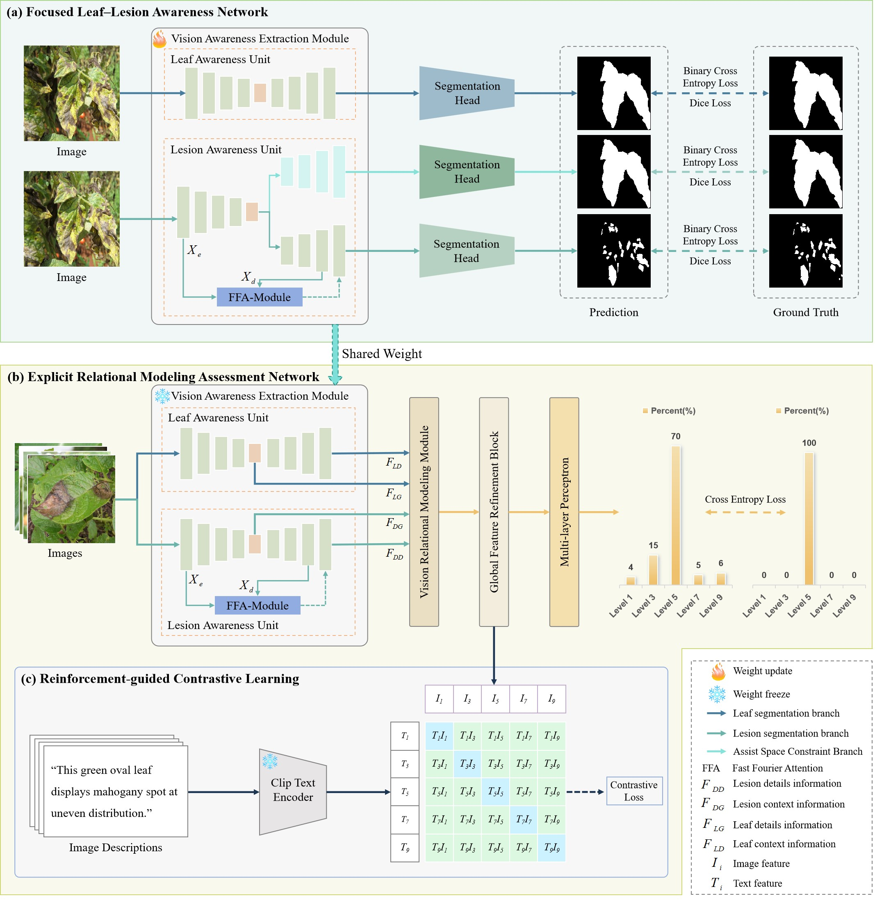
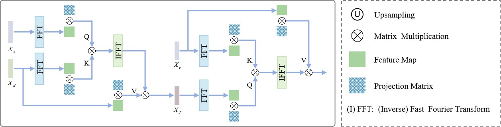
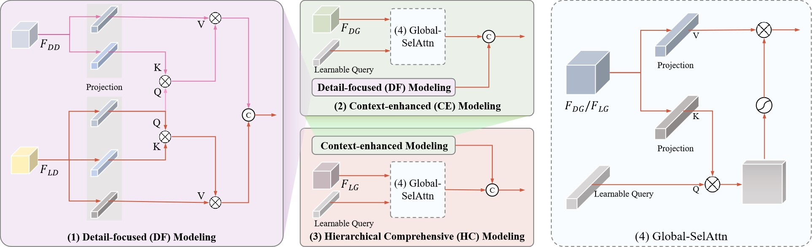
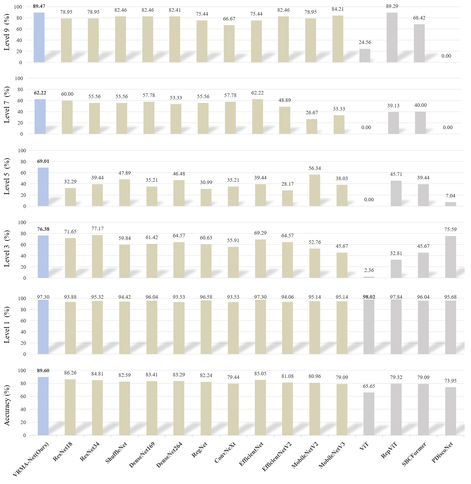

# FLARE
FLARE: Focused Leaf–Lesion Awareness via Explicit Relational Modeling for Field Disease Severity Assessment
# Abstract
Plant leaf disease severity assessment can assist in quantifying the progression of the disease, providing a basis for precise pesticide application, which in turn effectively enhances crop production.
Field diseases assessment is usually confronted with complex background disturbances, making it difficult for previous methods that primarily rely on hybrid perception to explicitly and independently recognize lesion and leaf regions. The resulting information entanglement introduces bias into severity assessment and ultimately limits the applicability of such methods in real-world scenarios.
To address this issue, we propose a focused leaf–lesion awareness via explicit relational modeling (FLARE) for disease severity assessment.
The proposed framework comprises two main components: a focused leaf–lesion awareness network (FLLA-Net) and an explicit relational modeling assessment network (ERMA-Net). 
The FLLA-Net utilizes lesion and leaf masks to guide the network’s focus on key regions. The resulting pretrained vision awareness extraction module (VAE-Module) is separately aware of prior visual knowledge of lesions and leaves, providing focused visual features for ERMA-Net.
The ERMA-Net shares and freezes the parameters of the VAE-Module to extract hierarchical representations of lesions and leaves explicitly. It then performs a vision relational modeling module (VRM-Module) to simulate the distribution of lesions on leaves. The resulting relational features are refined through a global feature refinement block. A reinforcement-guided contrastive learning strategy is then incorporated to enrich semantic information, followed by a multi-layer perceptron for predicting disease severity levels.
To support real-world applicability, we construct a comprehensive dataset of complex scenes with categories, segmentation masks, severity labels, and corresponding textual annotations.
Extensive experimental results demonstrate that our method achieves at least a 3.11\% improvement in severity prediction accuracy compared to existing assessment models, confirming the effectiveness and practical potential of FLARE for disease severity assessment.

# Framework


# LGR-Net


# HLFA-Net


# Environment
You can create a new Conda environment by running the following dependencies:
```
        CUDA 11.8
        Python 3.8 (or later)
        torch==1.13.1
        torchaudio==0.13.1
        torchcam==0.3.2
        torchgeo==0.4.1
        torchmetrics==0.11.4
        torchvision==0.14.1
        numpy==1.21.6
        Pillow==9.2.0
        einops==0.6.0
        opencv-python==4.6.0.66
```

# Dataset
Only the test set of the plant leaf disease severity assessment dataset is publicly available, but the training set will be made public when the paper is accepted. Download the dataset to the './dataset/' folder. You can download the this dataset in the following links:
http://flare.samlab.cn/

# PreTrained Model
The pre-trained FLLA-Net_Leaf, FLLA-Net_Lesion, and ERMA-Net models are linked below, and download them to the './checkpoint' folder. You can download the pre-trained weights in the following links:
http://flare.samlab.cn/

# Train
Train FLLA-Net_Leaf.
```
python trainUNet++.py
```

Train FLLA-Net_Lesion.
```
python trainDLAR_Net.py
```

Train ERMA-Net.
```
python trainL2RA_Net.py --epochs 300 --batch_size 16 \
    --model_path_lesion ./checkpoint/FLLA-Net_Lesion.pth \
    --model_path_leaf ./checkpoint/FLLA-Net_Leaf.pth
```

# Inference
```
python trainL2RA_Val.py --model_path_classifier ./checkpoint/ERMA-Net.pth
```


# Result



The website with relevant details of the paper: http://llrl.samlab.cn/home.html
